# Aplicando Perl à Grafologia

O objetivo deste artigo é descrever, de forma bastante sucinta, como aplicar processamento de imagens usando Perl em analise Grafológica para identificar padrões de comportamento e personalidade para a área de Recrutamento e Seleção muito utilizada no setor de Recursos Humanos das empresas.

Para entender a Grafologia se faz necessário alguns conceitos que serão uteis no decorrer do artigo. Para tanto vamos começar falando de algo muito simples, da folha de papel em branco, que na perspectiva grafológica, é o espaço de afirmação e expressão do individuo.     A superfície onde se escreve é como um universo para a Grafologia, uma vez que é nela onde se redige o texto em que será avaliado pela forma como nos manifestamos neste universo.

A maneira de um indivíduo se apropriar desse espaço ou universo, e de se afirmar através dele, é regulada respectivamente pelas normas sociais e culturais, que comparativamente são as margens: superior, inferior, esquerda e direita, bem como também pelo tamanho e volume das letras, que diminui à medida que se vai dando a evolução psicoafetiva e grafomotriz da pessoa.

O gesto gráfico está sob a influência imediata do cérebro. Sua forma não é modificada pelo órgão escritor se este funciona normalmente. Todos os gestos, de qualquer amplitude da escrita, estão diretamente ligados aos nossos estados psicoafetivos e psico-cognitivos. A forma particular que um individuo dá a uma determinada letra do alfabeto normalmente tem origem em diversos fatores físicos e emocionais.

Pois bem, à medida que nos envolvemos com o texto que escrevemos, nosso consciente tende a ir relaxando e começamos então, a ser comandados pelo inconsciente.  Assim, compreende-se que o estudo grafológico pode nos proporcionar muitas informações sobre quem escreve.

A Grafologia é uma técnica de observação e interpretação que possibilita o estudo do sujeito pela analise de sua grafia, e pode ser estudado sob três perspectivas:

* Projetiva: Pois projeta a personalidade a partir de certas convenções, como margens, acentos e parágrafos.
* Expressiva: Porque é um gesto de expressão da psicomotricidade.
* Representativa: Porque as formas da escrita representam uma escolha, mostram de maneira inconsciente a impressão que o escritor deseja passar a quem lê.

A princípio, o estudo da escrita era um processo empírico e se tornou mais robusto na França através de pesquisadores como *Jacques Raveneau* em trabalhos como *“Traité des Inscriptions em Faux”* (1665), além de *Michón e Crépieux-Jamin*, principalmente em relação à Grafologia, ressaltando o estudo da personalidade do indivíduo por meio da escrita. Através de suas pesquisas, *T. Wilhelm Preyer*, químico e fisiologista, demonstrou que a escrita é um ato cerebral.

*Edmond Solange Pellat*, considerado o pai da Grafoscopia, foi quem utilizou este pensamento de *Preyer* e estabeleceu as leis do grafismo, formulando em seu livro *Les Lois de L´écriture* as quatro leis que respaldam a Grafoscopia, baseando-se no princípio fundamental de que o grafismo é individual e inconfundível.

### Primeira Lei da escrita

O gesto gráfico está sob a influência imediata do cérebro. Sua forma não é modificada pelo órgão escritor se este funciona normalmente e se encontra suficientemente adaptado à sua função.

Quando o organismo está funcionando normalmente, o cérebro comanda a ação que é direcionada aos músculos, a fim de efetuar os gestos que irão gerar a escrita. Portanto, a sua produção pode ser efetuada, por exemplo, pela mão esquerda de um escritor destro, caso haja necessidade, sem que para isto se percam as características que individualizam a escrita.

### Segunda Lei da Escrita

Quando se escreve, o ‘eu’ está em ação, mas o sentimento quase inconsciente de que o ‘eu’ age passa por alternativas contínuas de intensidade e de enfraquecimento. Ele está no seu máximo de intensidade onde existe um esforço a fazer, isto é, nos inícios, e no seu mínimo de intensidade onde o movimento escritural é secundado pelo impulso adquirido, isto é, nas extremidades.

O ato de escrever se inicia por um comando, mas prossegue por um instinto natural, sem que o escritor se dê conta de todos os mínimos que ocorrem durante a sua produção. É conhecido como automatismo gráfico.

### Terceira Lei da Escrita

Não se pode modificar voluntariamente em um dado momento sua escrita natural senão introduzindo no seu traçado a própria marca do esforço que foi feito para obter a modificação.
Logicamente, contrapondo o que foi dito anteriormente, o esforço em escrever de forma consciente de todos os traços e minúcias, quebra a espontaneidade do ato em si. A naturalidade com que a escrita se processa se torna um dos elementos que auxiliam na distinção de uma falsificação, onde as formas do verdadeiro autor podem ser copiadas de uma maneira mais “arrastada”, perdendo a sua naturalidade e consequentemente, sua individualidade.

### Quarta Lei da Escrita

O escritor que age em circunstâncias em que o ato de escrever é particularmente difícil traça instintivamente ou as formas de letras que lhe são mais costumeiras, ou as formas de letras mais simples, de um esquema fácil de ser construído.

O escritor geralmente recorre a traços mais simples quando acontecem situações que limitam o ato da escrita, como: problemas com o instrumento escrevente, suporte inadequado, posição do punho escritor em relação ao suporte, produção da escrita em movimento, etc.

Por que a linguagem Perl foi à adotada para as analises e o processamento das imagens Grafológicas? Porque Perl é livre. Perl é uma linguagem estável e multiplataforma, usada em aplicações de missão crítica em todos os setores. Perl permite a criação de programas em ambientes UNIX, MSDOS, Windows, Macintosh, OS/2 e outros sistemas operacionais, é extremamente versátil.

A coisa agradável sobre Perl é que você pode aprender a escrever programas com bastante rapidez! Em essência, Perl tem uma baixa curva de aprendizado. Isto significa que você pode começar a programar com facilidade, sem ter que dominar um grande escopo de informação antes de escrever programas úteis.

Você sabe por que o camelo como símbolo do Perl?  Ele não é gracioso, não é bonito, parece que foi feito de pedaços de outros animais e se você tratá-lo mal ele cospe no seu olho.  Mas camelos são surpreendentemente rápidos, podem carregar cargas pesadas e vão continuar avançando felizes muito depois que seu cavalo morrer. Assim é o Perl se comparado com outras linguagens!

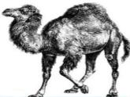

Entretanto é bom salientar que a tecnologia A ou B não importa! Pois, se não tiver conhecimento e sabedoria para saber que tem rodar o parafuso 0.001mm à direita ou à esquerda, de nada vale apenas a tecnologia.
Após esta introdução, vamos aplicar o Perl à Grafologia. Para tanto após coletar o texto a ser examinado o próximo passo é digitalizar este texto através de um scanner com resolução igual a 600 dpi, ou seja, 600 pontos por polegadas, e a partir desta imagem é de onde serão examinados os elementos gerais da escrita, objetivos e subjetivos.

No levantamento dos elementos objetivos, serão focalizados, por exemplo, a inclinação axial, o calibre dos caracteres, interessando, sobretudo, a relação de sua proporção entre todos eles.

Constatação do alinhamento gráfico, em relação à linha de pauta – impressa ou ideal, o andamento da escrita – os espaçamentos, retomadas do traço que tanto podem ser características do punho escritor como resultado de imitações.

Estudar os traços complementares de alguns caracteres, como o corte do t, quanto à sua localização na haste, ao seu tamanho, sua localização em relação à própria letra – acima da haste, à esquerda ou à direita, registrando-se os pormenores. O mesmo é feito em relação ao pingo do i, registrando sua forma e localização e até sua inexistência e, finalmente, a cedilha do c cedilha.

O texto a ser analisado capturado pelo scanner é transformado em uma imagem digital, que após o processamento será representada de forma tridimensional, e utilizando uma codificação de números binários que permite o seu armazenamento e processamento.

Após este pré-processamento, passa-se para o reconhecimento de padrões, onde se classifica os traços a partir de informações estatísticas extraídas dos padrões encontrados no texto analisado, em que no contexto deste trabalho, a cor é usada para classificar os objetos de interesse, e este processo é feito de forma automatizada, através de um programa escrito na Linguagem Perl.

Durante o processamento da imagem para extração dos padrões grafológicos são analisados algumas grandezas como: Luminância, Refletância, Matiz, Saturação e Tom, estas informações pode ser obtidas pelas bibliotecas fornecidas pela própria linguagem.

A luminância é uma medida da densidade da intensidade de uma luz refletida numa dada direção, cuja unidade SI é a candela por metro quadrado (cd/m²). Descreve a quantidade de luz que atravéssa ou é emitida de uma superfície em questão, e decai segundo um ângulo sólido.

A refletância é a proporção entre o fluxo de radiação eletromagnética incidente numa superfície e o fluxo que é refletido.

O matiz é uma das três propriedades da cor que nos permite classificar e distinguir uma cor de outra através de termos como vermelho, verde, azul, etc. A matiz também é uma das três dimensões em alguns modelos de cor junto com saturação e luminosidade às quais, às vezes, se junta outra dimensão, para emular outro atributo, a transparência.

O tom é o atributo distinguível de uma cor e varia de intensidade quanto à saturação, é a pureza ou opacidade de uma cor. O valor tonal representa para nós a intensidade de luminosidade, criando a ilusão do tridimensional. Justamente com a perspectiva, o tom traz por meio da representação gráfica a sensação de volume.

A saturação ou grau de pureza da cor é um parâmetro que especifica a qualidade de um matiz de cor pelo grau de mixagem do matiz com a cor branca, sendo usual referir-se também à refletância da amostra como um atributo daquela cor.

Todos estes conceitos são importantes no processamento e identificação dos padrões grafológicos. Para classificar os padrões grafológicos o processamento é feito utilizando o algoritmo K-MEANS, em seguida a comparação das distâncias euclidianas, onde são levados em consideração informações de luminância e saturação, para determinar, por exemplo, a sobreposição do corte da letra t, da letra g, da letra p, o cedilha, do pingo do i, e assim por diante.

No processo de analise grafológico são observados vários aspectos, então não são as curvas nas letras que indicam diferença no comportamento, por exemplo. Entretanto, uma escrita com pontas diz que a pessoa tende a ser resistente, a se proteger, podendo ser até intransigente, mas em compensação tende a ser firme, dura, ser líder.

A curva na letra é sinal de sedução, é o de um perfil que consegue as coisas por meio da maleabilidade, da negociação, do convencimento.  Durante a analise são feitos cálculos que permitem identificar qualquer alteração de formato dentro da mesma escrita, o que leva a identificar uma mudança de comportamento do individuo analisado, ou seja, quando uma pessoa começa a escrever de um jeito e termina de outro, vai revelar uma instabilidade de energia, de humor, e pode indica desequilíbrio.

Para executar todos estes cálculos é utilizado o padrão de cores CIE-XYZ, Commission Internationale d'Eclairage, que representa um espaço de cor matemático que independe dos dispositivos de aquisição das imagens. Em 1931 a CIE  definiu três novas primárias: X, Y e Z.  Com essas novas primárias, todas as cores podem ser reproduzidas com valores positivos, onde temos o Y representando a luminância, e o x e o y croma, sendo x e y derivados matematicamente de X, Y e Z.

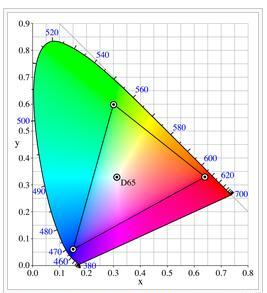
> Diagrama de cromaticidade do padrão CIE 1931 xy

Utilizando a biblioteca do Perl GD, que é uma biblioteca gráfica, e também Color::Similarity::HCL, que é uma biblioteca para trabalhar com cores, além das bibliotecas Math::Trig e Math::Round que são bibliotecas matemáticas,  para fazer os cálculos trigonométricos e estatísticos necessários  a partir da imagem coletada e processada, é possível fazer as identificações do padrões grafológicos de modo a auxiliar o profissional de Recursos Humanos no momento de selecionar o melhor profissional para um determinado cargo.
Abaixo temos a escrita de uma criança de 6 anos e 3 meses do 1º ano, em que foi observado a ausência de margens superior e esquerda na folha de papel, ou na superfície onde se escreve.

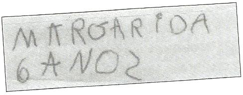
> Figura 1: Imagem original

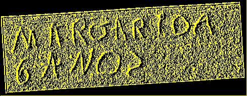

> Figura 2: Imagem processada pelo programa Perl

Após o processamento da imagem original, figura 1, é possível verificar como ficaria esta imagem num formato 3D, ou formato de profundidade da escrita. Neste ponto o programa separa as letras para tratar o seu formato e espacejamento entre elas, que também tem influência nas caracterizas da analise grafológica.

Na figura 3, temos a letra M e a Letra A, em que o programa identificou que o traço que corta a letra A, é bastante superior e muito leve,  e o espaçamento entre as letras segue um padrão.

> Figura 3 - Analise das letras M e A.

Para fazer a analise e as transformações e retirada de elementos alheios a escrita, é feito uma separação através da matiz que identifica o elemento escritor, neste caso a imagem é processada e é feito esta separação. Para tanto a imagem original é transformada em um padrão de cores que permite fazer esta separação, o padrão YCbCr.

Nas figuras 4, 5 e 6 é mostrado os resultados obtidos por este processamento, em que foi utilizada a letra O.

> Figura 4. Imagem original

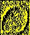

> Figura 5. Imagem processada segundo o modelo YCbCr.

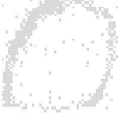

> Figura 6. Imagem final.

Após o processamento o sistema identifica à espessura e a forma da escrita, no caso desta letra a força é mais acentuada do lado esquerdo, e sua inclinação axial é para direita.

Abaixo temos outra analise feita pelo programa que identifica o perfil do escritos. Análise da escrita de um indivíduo com capacidade de assimilação de conteúdos.

Características da escrita: agrupada/aberta com predomínio das curvas, bom espaçamento entre as palavras e linhas, bom enquadramento no papel, espontânea e progressiva. Individuo com grande capacidade de assimilação.

Na figura 7 temos o texto original, na figura 8 uma parte do texto que foi extraído como exemplo para se fizer a analise, em seguida, na figura 9, têm-se duas letras retiradas do texto original e que foram processadas para gerar a informação da figura 10, que é base para os cálculos estatísticos e trigonométricos usados pelo programa para definir os padrões grafológicos.

Dentre alguma das informações extraídas da figura 10 tem-se o agrupamento e abertura da escrita, o predomínio das curvas e a não retirada do elemento escritor do papel no momento da escrita, demonstrando continuidade na escrita.

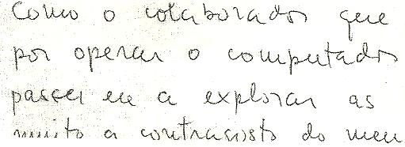

> Figura 7 - Imagem original

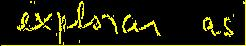

> Figura 8 - Imagem processada.

> Figura 9 - Imagem original.

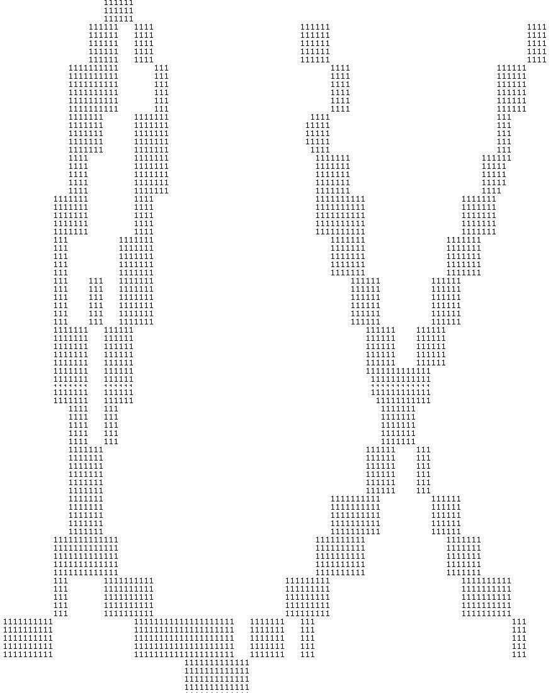

> Figura 10 - Imagem processada para extração das características.

A próxima analise feita, detectou que o individuo é uma pessoa que assume riscos calculados, segue abaixo a sequencia da analise que vai da analise original, figura 11 até a imagem processada e de onde foram extraídos os padrões, figura  16.

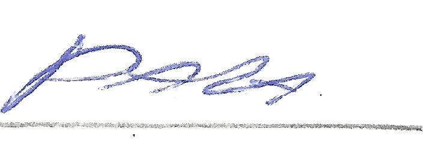

> Figura 11 - Imagem original.

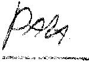

> Figura 12 - Imagem processada para tons de preto e branco.

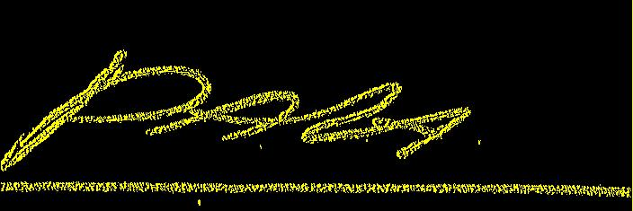

> Figura 13 - Imagem processada para o padrão YCbCr

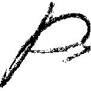

> Figura 14 - Letra P processada preto e branco

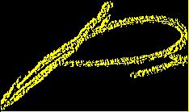

> Figura 15 - Letra P padrão YCbCr

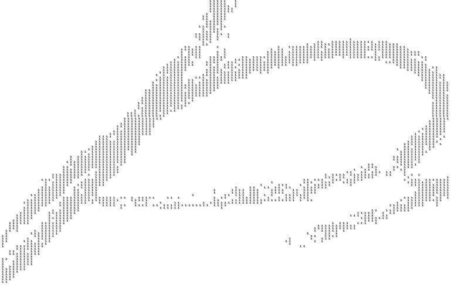

> Figura 16 - Imagem processada para extração das características.

Neste individuo a característica predominante é de um individuo que assume riscos calculados.

Como se pode observar utilizando conhecimentos de processamento de imagens digitais, matemática, estatística, reconhecimento de padrões, e neurociência aplicados a uma linguagem de programação altamente poderosa é possível desenvolver ferramentas que auxiliem profissionais de todas às áreas na tomada de decisão.

A Grafologia é uma ferramenta fundamental em um processo seletivo, chegando a ser decisiva. Sendo que esta etapa deve ser posterior à triagem do currículo, mas anterior à entrevista pessoal.

Uma vez que pela análise comportamental dos traços que a pessoa apresenta em sua redação é possível ao entrevistador conduzir a entrevista de forma a buscar confirmação daquela tendência.

Mesmo que o candidato queira mentir ou omitir fatos durante a entrevista, ele não consegue fazê-lo ao escrever. A escrita denuncia o que as palavras podem estar dissimulando. A escrita é muito menos manipulável.

Há candidatos que fazem teatro; mas não pode esconder aquilo o que está em seu cérebro. E mesmo a pessoa estando nervosa para escrever a escrita dela não se altera.

AUTOR
-----

**Hailton David Lemos**

Grupo de pesquisa Análise Evolutiva.

Licença
------

Texto sob Creative Commons - Atribuição - Partilha nos Mesmos Termos 3.0 Não Adaptada,
mais informações em [http://creativecommons.org/licenses/by-sa/3.0/](http://creativecommons.org/licenses/by-sa/3.0/)

